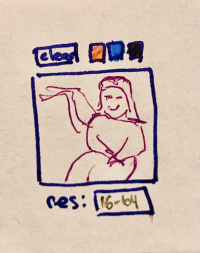
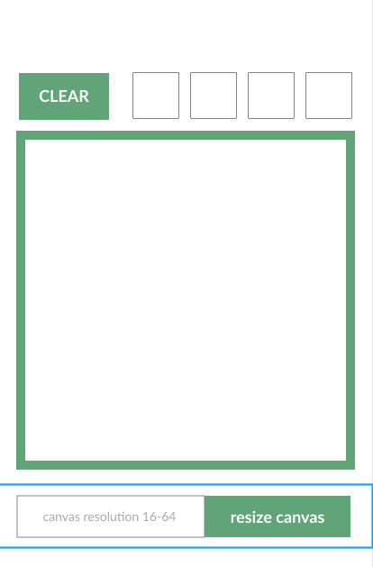
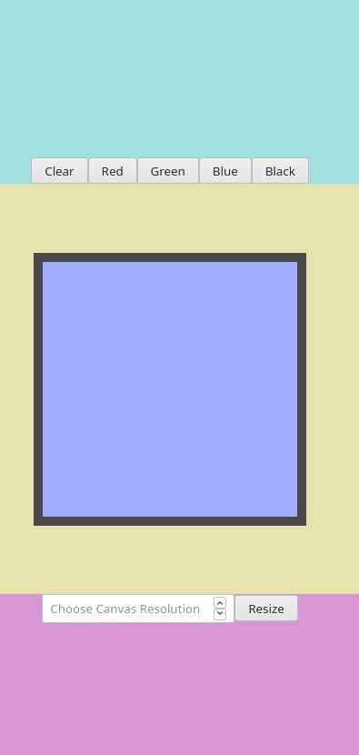

# Hover-Doodle
An Etch-A-Sketch web app.

## Learning Goals
- get proficient at DOM manipulation with JS
- apply both CSS grid **and** flexbox
- try to make the user experience at least bearable

## Project Plan + Progress so far
- [x] write out the specification
  - there should be a drawing area (divs created in js)
  - user should be able to define the resolution (div amount)
  - user should be able to clear/reset the area
  - (*optional*) add a simple color palette
- [x] draw a simple wireframe/layout sketch 
- [x] create a layout in figma 
- [x] structure your html
- [ ] write pseudocode for js
- [x] apply basic grid to the web page (color the grid parts) 
- [x] make sure to leave a grid area for the sketch pad (div), where the js will create 16x16 divs (use flexbox wrap)
- [ ] set up a hover effect in JS for the sketch area either by adding a new class or a new background color style
- [ ] let the user clear the sketch pad
- [ ] let the user choose resolution
- [ ] tweak up the css